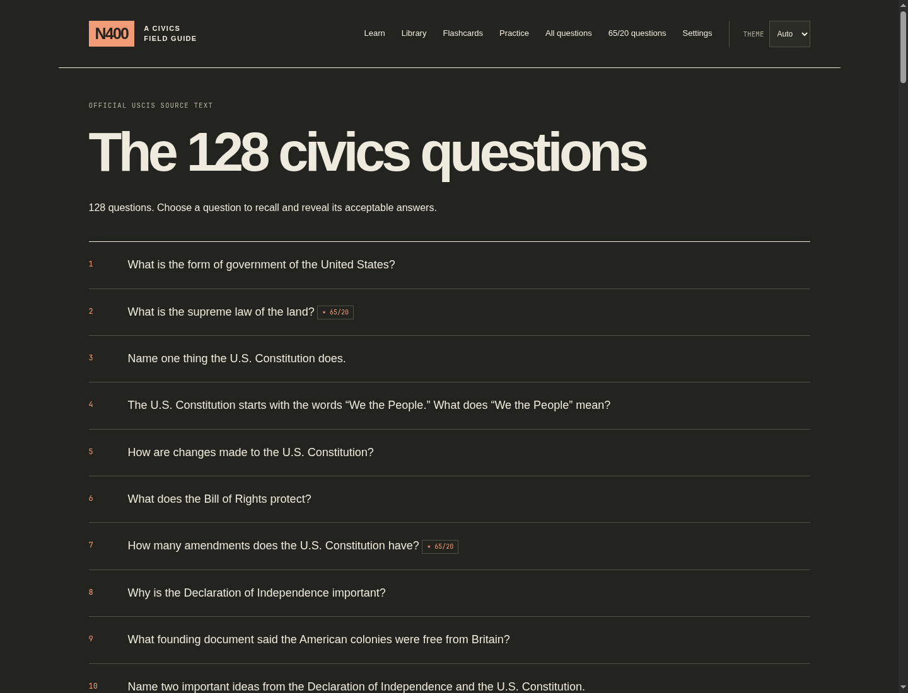
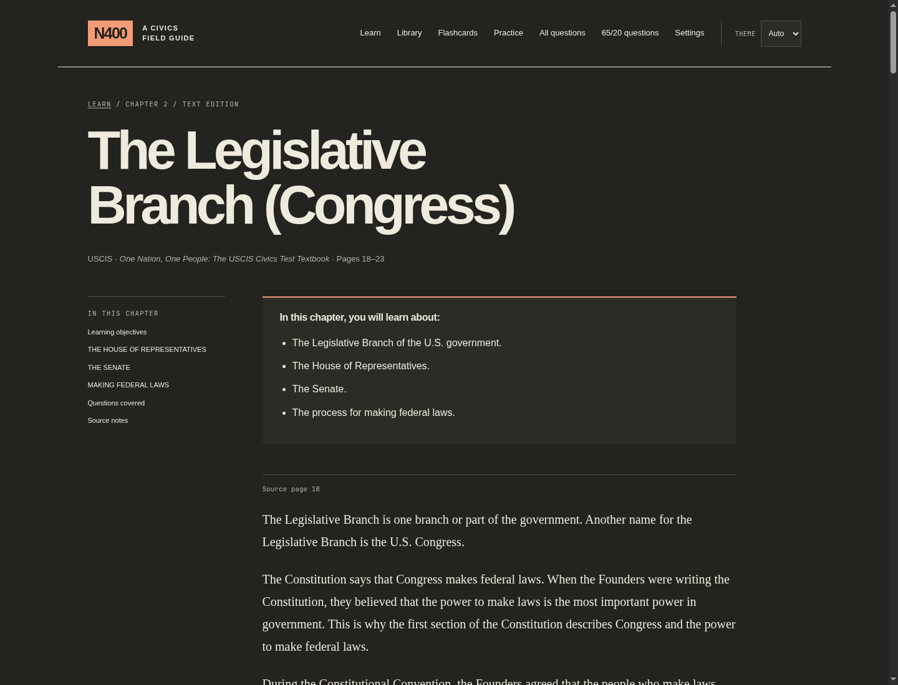
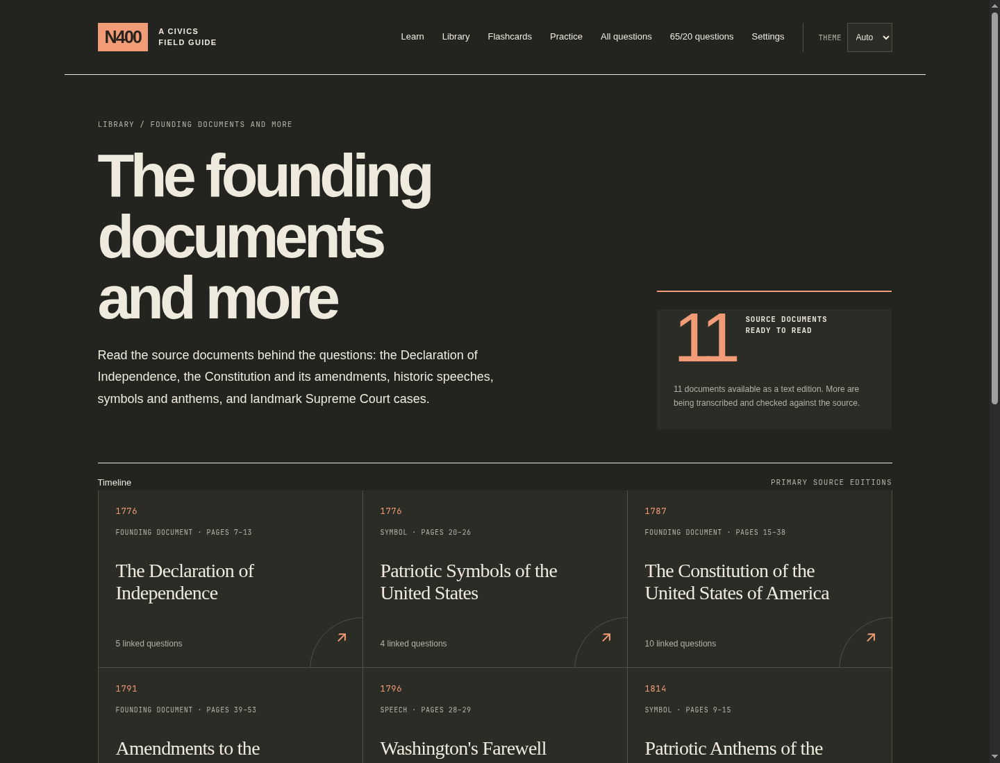
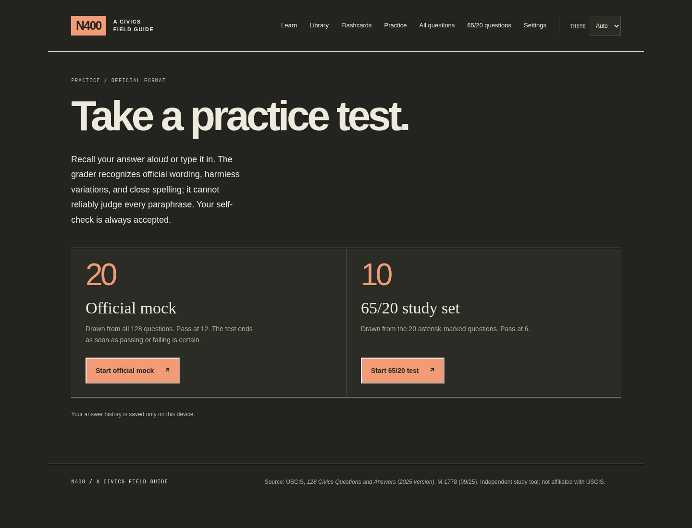

# N400: Beyond the Test

> Learn the story. Love the country.

An offline, local-first study companion for the USCIS naturalization civics
test. N400 puts the official 128-question bank, source-verified reading
editions, flashcards, and practice tests in one small Go binary — with no
account, tracking, or internet connection required to study.



## Why N400

- **Study the official questions.** Browse all 128 questions or focus on the
  65/20 set. Reveal the acceptable official answers when you are ready.
- **Practice in the test format.** Take a 20-question mock or a 65/20 study
  set. Answer aloud or type your answer; automatic feedback is advisory and
  every question retains an “I got this right” self-check.
- **Learn the context.** Twelve reader-friendly chapters reproduce the USCIS
  study guide’s text, connect concepts to relevant questions, and include
  accessible diagrams where the source uses visual structures.
- **Read primary-source editions.** The library organizes founding documents,
  historic addresses, symbols, and anthems on a navigable timeline.
- **Review with local flashcards.** A five-box Leitner deck schedules review
  intervals and stores progress only on your device.
- **Keep changing facts honest.** Questions with answers that can change
  always point to USCIS for verification. Bundled values are clearly dated,
  never represented as live USCIS data.

| Learn from source material | Explore the historical library |
| --- | --- |
|  |  |



## Run it

Download the archive for your platform from [Releases](../../releases), unpack
it, and run the binary. It starts a browser on your computer and listens only
on `127.0.0.1`.

Or build it from source (Go 1.22+):

```sh
make build
./bin/n400
```

For a fully offline launch without opening a browser:

```sh
./bin/n400 --offline --no-browser --port 8400
```

Then visit <http://127.0.0.1:8400>. You can move the binary anywhere and run
it without this repository, a network connection, Node, cgo, or a database.

## Privacy and accuracy

N400 is deliberately local-first. Study progress, theme selection, and saved
settings remain on your machine. An optional street-address lookup is sent to
the Census Bureau only to resolve an ambiguous congressional district; it is
never saved. ZIP codes are not treated as districts when they span more than
one district.

The application preserves the source wording rather than rewriting it. Its
content checks validate question numbering, required answer counts, links,
credits, and source-text coverage at startup and in tests. It is a study aid,
not legal advice or an official USCIS service; use USCIS to verify changing
answers before your interview.

## Sources, images, and reuse

The original program code is available under [LICENSE-CODE](LICENSE-CODE).
Study text, PDFs, images, and other source-derived assets are **not** covered
by that code license. See [CONTENT-NOTICE.md](CONTENT-NOTICE.md) for the
important boundaries, including the exclusion of Citizen’s Almanac images.

### Source documents

N400 is built from checked-in, source-reviewed text derived from these USCIS
publications:

- *2025 Civics Test: 128 Questions and Answers*
- *One Nation, One People: The USCIS Civics Test Textbook* (2025 Civics Test
  Study Guide)
- *The Declaration of Independence and the Constitution of the United States*
- *The Citizen’s Almanac*

The PDFs are development-only reference materials. They are intentionally
ignored by Git and are not included in this repository or its release archives.

Every embedded image has a manifest entry, printed caption, credit, and
provenance record. The library identifies its source editions and provides the
required USCIS citation where applicable. Do not assume an image can be reused
merely because it appears in this repository; review its individual rights
statement first.

## Develop

```sh
make test       # hermetic race-test suite
make lint       # go vet + staticcheck (install staticcheck separately)
make build
make build-all  # Linux, macOS, and Windows for amd64 and arm64
```

`make ingest` is a development-only operation that requires Poppler. It is not
needed to build or run the app. See [AGENTS.md](AGENTS.md) for source fidelity,
privacy, and content-review rules, and the chapter/library authoring notes
under `internal/content/data/` for maintenance details.

## Releases

GitHub Actions tests each push and pull request. Pushing a version tag such as
`v1.0.0` creates a release with six CGO-free archives — Linux, macOS, and
Windows for both amd64 and arm64 — plus `SHA256SUMS`.
